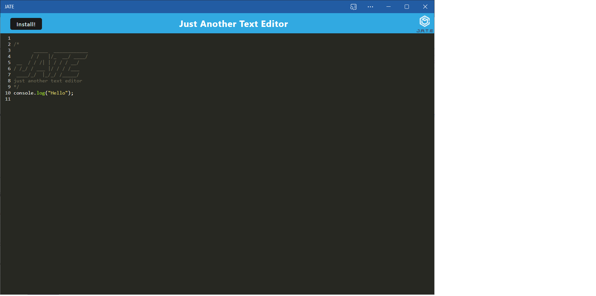
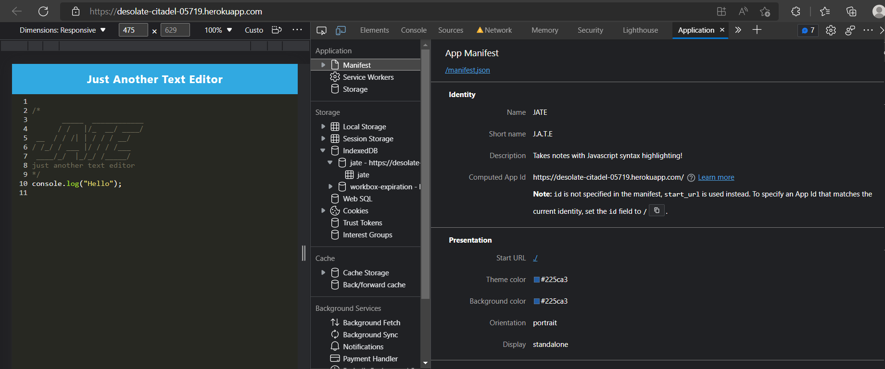
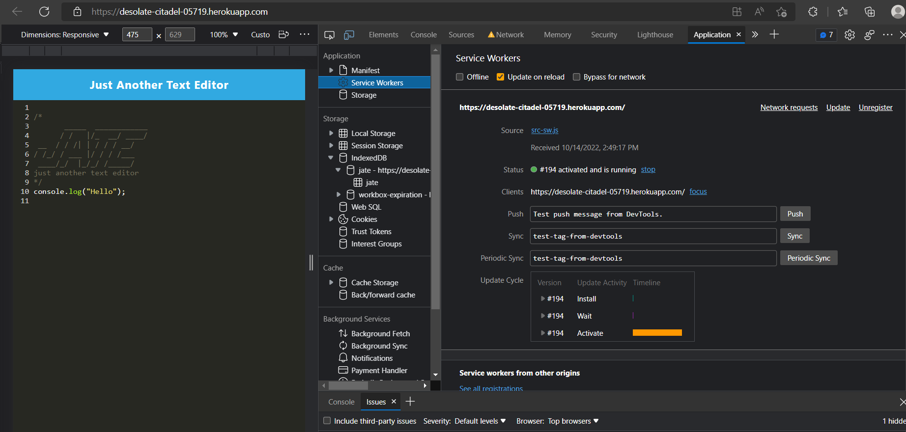
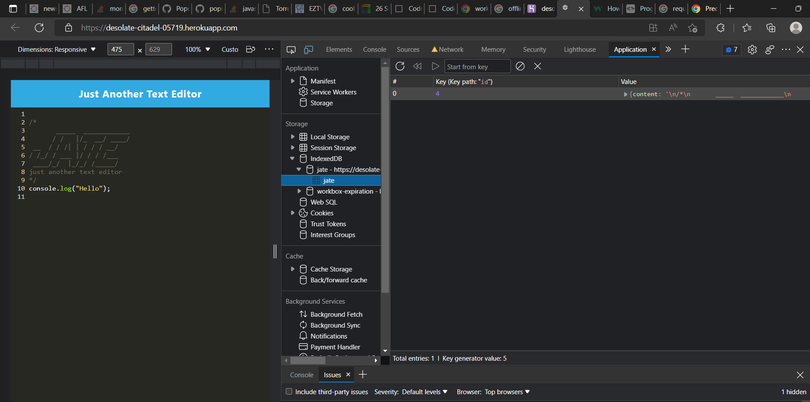

# Text Editor

## Description

This is an application is a text editor where the user can write javascript and it will be highlighted for them.

- The user can enter the notes area by clicking the "Get Started" button, where they will be redirected to the notes page.
- If the user manually enters a different route in the sites location other than /notes then they will be redirected back to the home page.
  <br>

The user can input a title and content in the notes area and save it to storage by pressing the save icon.

- The stored note is added to the list on the left.
- The user can reload a note to the main note area by clicking the note.
- The user can delete the note by clicking the delete icon on that note.
  <br>

To clear the note area so a new note can be entered the user can click the plus (+) icon at the top.

- The user can only add the note when there is content within the title and text area.

<br>

## Table of Contents

- [Mock Up](#mock-up)
- [GitHub Link](#git-link)
- [Heroku Live Link](#heroku-live-link)
- [Installation Instructions](#install-instructions)
- [Executing Instructions](#)
- [Screenshot](#Screenshot)

---

## Mock-Up

The following animation demonstrates the application functionality:



The following image shows the application's `manifest.json` file:



The following image shows the application's registered service worker:



The following image shows the application's IndexedDB storage:



## Git Link

The link to the GitHub repository of the assignment is <br>
[https://github.com/jkoufalas/Text-Editor](https://github.com/jkoufalas/Text-Editor)

---

## Heroku Live Link

The link to a running version of the application <br>
[https://desolate-citadel-05719.herokuapp.com//](https://desolate-citadel-05719.herokuapp.com/)

## Install Instructions

The user needs to install the dependancies of express js

```
npm run build
```

---

## Executing Instructions

For the server side express js to run the following

```
npm run start
```

---

## Screenshot


