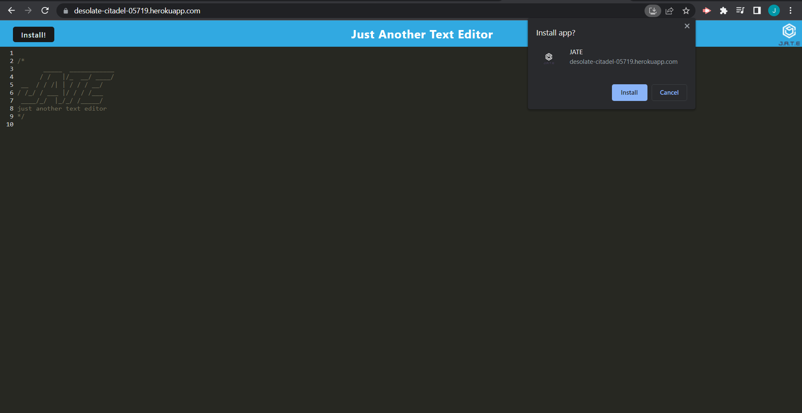
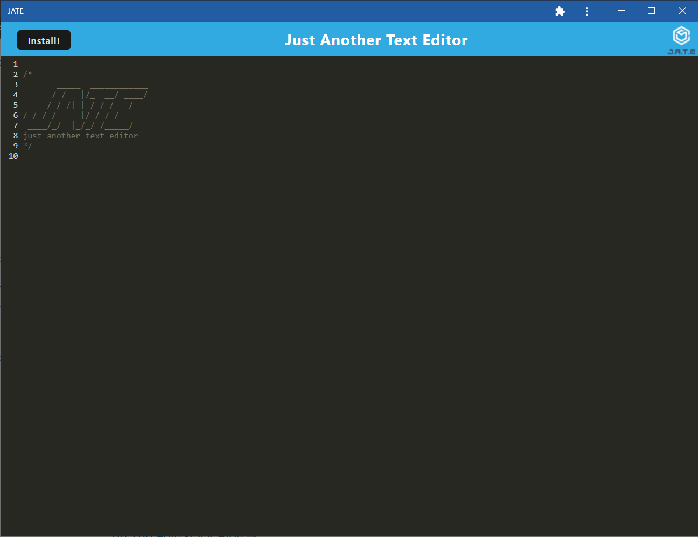

# Text Editor

## Description

This is an application is a text editor where the user can write javascript and it will be highlighted for them.

- The user can type anywhere within the text area and write javascript code and it will highlight the syntax.
- Whenever the user clicks elsewhere the application will save the contents to the browsers IndexedDB.
- When the user starts loads the application, if the user had previously used the application and there is a database already create. Then the application will load the previous contents to the application text area.
- The user can install the application to their device.
- A service worker caches the application so that when the user is offline they can still use the application.

<br>

## Table of Contents

- [Mock Up](#mock-up)
- [GitHub Link](#git-link)
- [Heroku Live Link](#heroku-live-link)
- [Installation Instructions](#install-instructions)
- [Install Application to Device](#install-instructions)
- [Executing Instructions](#executing-instructions)
- [Screenshot](#Screenshot)

---

## Mock-Up

The following animation demonstrates the application functionality:


The following image shows the application's `manifest.json` file:


The following image shows the application's registered service worker:


The following image shows the application's IndexedDB storage:


## Git Link

The link to the GitHub repository of the assignment is <br>
[https://github.com/jkoufalas/Text-Editor](https://github.com/jkoufalas/Text-Editor)

---

## Heroku Live Link

The link to a running version of the application <br>
[https://desolate-citadel-05719.herokuapp.com//](https://desolate-citadel-05719.herokuapp.com/)

## Install Instructions

The application is split into a client and server model. The client section holds the information that is served to the clients browser. The server holds the information related to the server side of the application.

The user needs to install the dependancies listed in both the client and server areas.
To do so, the user needs to run

```
npm run install
```

This will enter both the client and server sections and run an install on both.

To build the application, where the content of the dist folder is populated to be served to the client, the user needs to run the

```
npm run build
```

To run the application, the user needs to run

```
npm run start
```

This will run a build for the client and then start the server.

---

## Install Application to Device

To install the application to the users device the user can click the install button on the title bar, or use the install application icon at the end of the location bar.
When they do so, a prompt will ask them to Install or Cancel.

The following image shows the application prompting to install the application:



The following image shows the application installed natively on the users device:



## Executing Instructions

For the server side express js to run the following

```
npm run start
```

---

## Screenshot


